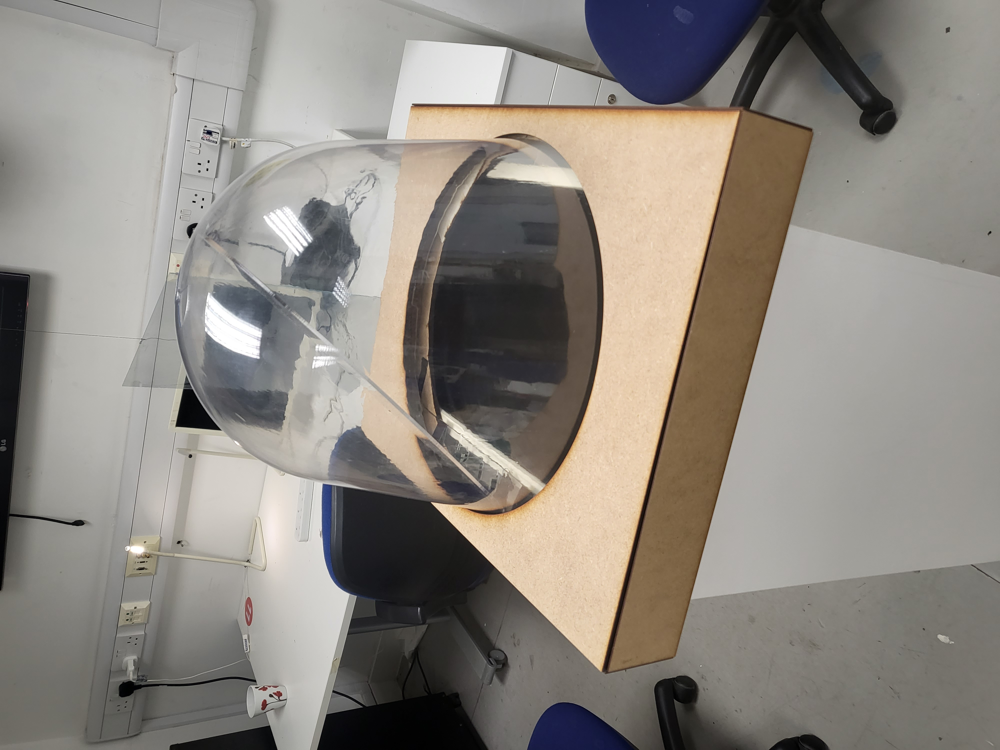

import Gallery from "../../../components/Gallery.astro";

## i made a font

I made a font for this project. its quite involved so I stuck it in another post. [how did i make this font](/learningjournal/central_station_typeface)

## light information

The first thing i did was to get the correct font size and kerning for the light information. The body copy is Authentic Sans 130, as per the design proposal from last year.

After asking around the studio, we picked for header 84pt with 87 leading and -35 kerning, and for the body 48pt with 53 leading and -30 kerning. Gina's input was especially helpful here on making text accessible.

### side mission: a logo

i saw these cool graphics in this archive book and i thought the light information sign would look more "official" if there was a logo on it.

<Gallery pattern='csp_logo' height='20rem' />

### cutting laser

with gina's help and some feedback from others we finalized the design on the

### building it

I got help from Scott and Jamie in the Reid Woodshop to build a wooden version of the stand, as deadlines were closing in (oh no) and Jamie told me that the metals guy (Nick) was not gonna be free until like a week after, and so we couldn't build the metal version in time.

<Gallery pattern='csp_lightinfobuild' />

scott actually made the files super quick (i forgot the software he used) and advised on how to make this the fastest, which was to laser cut 6mm mdf.

after this we learned that the deadline was extended (phew)

### this is what it ended up looking like (yay)

<Gallery pattern='csp_lightinfofinal' />

## ghost objects

One of the problems with the ghost objects is that we needed an acrylic panel in a specific angle (45deg) fit snugly inside this irregularly shaped dome.

I tried to solve this by assuming that it was a cone, with a sphere replacing the tip. with this in mine, i measured the circumference of the tangent where the sphere and cone line up with a piece of tape, then measuring the tape.(shoutout marco for the idea)

<Gallery pattern='csp_domemeasure' height='20rem' />

This allowed me to make a 3d model in fusion, and i was able to slice a "close enough" cut of the shape needed to fit inside the dome.

<Gallery pattern='csp_domebuild' height='20rem' />

From feedback I raised raised the inner acrylic so it sits higher inside and also raised the angle to 55deg.

I actually messed up the measurements so it didnt fit right but I fixed it. I made a simple MDF cutout to clean up the dome a little bit and to hold the angle inside.

<Gallery pattern='csp_domestructure' height='20rem' />

shoutout Andy from lasercutting for getting these cut so fast.

so the tape idea didnt work out quite well. The next step I think is that we can used instead a metal hinge and some machine screws and bolts to hold it together instead.
