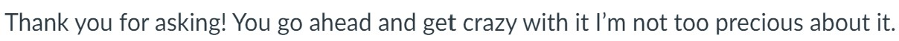
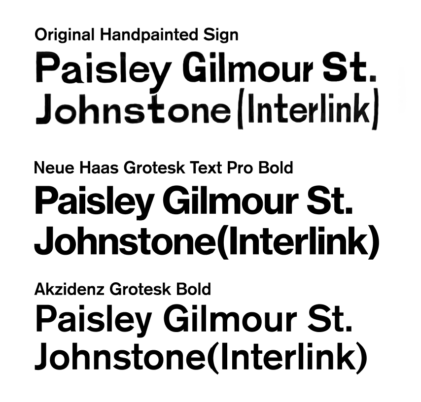

We (GSofA IxD Year 3) were tasked with finishing an exhibition on some old trains for Glasgow Central Station ([Glasgow Central Tours](https://www.glasgowcentraltours.co.uk/) - our clients), which meant we were taking on concepts and creative briefs that others (last year's year 3 students) decided upon with approval from the client. One of these briefs was to include a custom-made typeface based on some old signs from the station.

import { Image } from "astro:assets";
import type1 from "./resources/central_station_typeface/orignaltype1.jpg";
import type2 from "./resources/central_station_typeface/WhatsApp Image 2023-10-10 at 05.26.59_d6fba0e7.jpg";
import type3 from "./resources/central_station_typeface/WhatsApp Image 2023-10-10 at 05.26.59_dd8a30dc.jpg";

  <Image
    src={type1}
    style='width: 100%;'
    alt='hand painted signs depicting various station names'
  />
  <Image
    src={type2}
    style='width: 100%;'
    alt='more signs depicting station names'
  />
  <Image
    src={type3}
    style='width: 100%;'
    alt='even more signs depicting station names'
  />

[Paula Pokorna](https://paulapokorna.wordpress.com/interactive-systems/), a student from last year, started on this custom fontface. Now, its passed to me to finish it. In her own words:

## Early critique on the typeface (from my wonderful flatmates)

At the beginning of taking on this project, I showed my flatmates the typeface as-is, and obtained some informal feedback. None of them were graphic designers, however and they had a bit of a hard time articulating why they felt a certain way. I've tried to distill their thoughts, so here it goes:

1. Its hard to read, one pointed out that the 'spacing' of the text felt off.
2. The font did not seem to look cohesive.
3. there is no need for a digital design to "copy" exactly a hand painted, physical one.

The first two critiques are fixable, in my opinion, fixing the kerning or adjusting paths in the font itself can make them more cohesive. (I'll explore this in detail later on).

The more interesting critique is the third one, which is a distinctly post-digital[^postdigital] opinion and a much more fundamental question on the typeface concept.

[^postdigital]: [Cat Graffam explains the post-digital movement](https://youtu.be/yhLb0m_6EEs?si=_OZ16Qnsp1IQ3NDq&t=333) well in her video about a post-crypto future.

A digital font, currently, cannot exactly replicate the intricacies of a handwritten font. I should instead lean into the strengths of the digital medium rather then attempt to replicate the impossible. As my flatmate josh put it: I should be _inspired by_ not _copy_ the font. This also gives me space for modern sensibilities and innovations in type design.

- How can I translate the "feel" of paintedness without tracing exactly what I see?
- What are the limitations of digital typefaces today and how can I make them in into advantages?

## what font the hand painted sign based on?

Unfortunately the signs don't include all the letters, making it so that a simple trace out of the question. My thought was that I might be able to find the original the painter based their stencils off of.

My first guess was some kind of grotesk font, maybe close to neue haas grotesk. This ended up being a pretty good guess as Haas was a type designer at around the time the glasgow central station was built. another popular grotesk font in 1860s britain was akzidenz grotesk (known as THE grotesk font... shes was the it girl fr)

both of these fonts are close but not the same, the painted sign has the style of akzidenz extra bold but the thickness of medium or bold, with some characters leaning towards Neue haas, like the letter Q.

As i researched, I learned that akzidenz is not one family, but in fact several different fonts designed by different foundries:
[German, Swiss, and Austrian typefaces named Royal or Akzidenz-Grotesk](https://www.typeoff.de/2019/02/typefaces-with-royal-accidenz-or-akzidenz-in-their-names/)

grotesk fonts were popularized after the first world war, representing the modernist "international style"[^international] swiss design. I think it aptly represents the turn of the century industrialization of scotland. [Footnotes C: Retracing the origins of Akzidenz-Grotesk
](https://www.typeoff.de/2019/07/footnotes-c-retracing-the-origins-of-akzidenz-grotesk/)

[^international]: its also important to critique the universalism in the modernist movement from a postcolonial perspective. (imagine the ego of calling your style "international", also le corbusier was a nazi sympathizer)

So we end up in a bit of a pickle, and I couldn't find any other fonts that were closer visually. With deadlines fast approaching, I realized I had to find another way.

## the anatomy of an old, painted signage.
