We (GSofA IxD Year 3) were tasked with finishing an exhibition on some old trains for Glasgow Central Station ([Glasgow Central Tours](https://www.glasgowcentraltours.co.uk/) - our clients), which meant we were taking on concepts and creative briefs that others (last year's year 3 students) decided upon with approval from the client. One of these briefs was to include a custom-made typeface based on some old signs from the station.

import { Image } from "astro:assets";
import type1 from "./orignaltype1.jpg";
import type2 from "./WhatsApp Image 2023-10-10 at 05.26.59_d6fba0e7.jpg";
import type3 from "./WhatsApp Image 2023-10-10 at 05.26.59_dd8a30dc.jpg";

  <Image
    src={type1}
    style='width: 100%;'
    alt='hand painted signs depicting various station names'
  />
  <Image
    src={type2}
    style='width: 100%;'
    alt='more signs depicting station names'
  />
  <Image
    src={type3}
    style='width: 100%;'
    alt='even more signs depicting station names'
  />

[Paula Pokorna](https://paulapokorna.wordpress.com/interactive-systems/), a student
from last year, started on this custom fontface. Now, its passed to me to finish
it. In her own words:

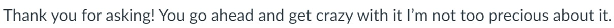

## Analysis: Early critique on the typeface (from my wonderful flatmates)

At the beginning of taking on this project, I showed my flatmates the typeface as-is, and obtained some informal feedback. I've tried to distill their thoughts, so here it goes:

1. The font did not seem to look cohesive.
2. Its hard to read, many pointed out that the 'spacing' of the text felt off.
3. there is no need for a digital design to "copy" exactly a hand painted, physical one. ("You can see that it was made in illustrator")

The first two critiques are fixable, in my opinion, fixing the kerning or adjusting paths in the font itself can make them more cohesive. (I'll explore this in detail later on).

The more interesting critique is the third one, which is a distinctly post-digital[^postdigital] opinion and a much more fundamental question on the typeface concept.

[^postdigital]: [Cat Graffam explains the post-digital movement](https://youtu.be/yhLb0m_6EEs?si=_OZ16Qnsp1IQ3NDq&t=333) well in her video about a post-crypto future.

A digital font, currently, cannot exactly replicate the intricacies of a handwritten font. I should instead lean into the strengths of the digital medium rather then attempt to replicate the impossible. As my flatmate josh put it: I should be _inspired by_ not _copy_ the font. This also gives me space for modern sensibilities and innovations in type design.

- How can I translate the "feel" of paintedness without tracing exactly what I see?
- What are the limitations of digital typefaces today and how can I make them in into advantages?

## what font the hand painted sign based on?

Unfortunately the signs don't include all the letters. My thought was that I might be able to find the original font the painter based their stencils off of to use as reference.

My first guess was some kind of grotesk font, such as Neue Haas Grotesk (a georgia tech industrial design favorite). Haas was a type designer at around same time as the construction of the station. Another contender was a popular font in 1890s britain, Akzidenz-Grotesk[^akzidenz]. (she was the it girl fr)

[^akzidenz]:
    As i researched, I learned that akzidenz is not one family, but in fact several different fonts designed by different foundries:
    [German, Swiss, and Austrian typefaces named Royal or Akzidenz-Grotesk](https://www.typeoff.de/2019/02/typefaces-with-royal-accidenz-or-akzidenz-in-their-names/).

Both of these fonts come close but there are slight differences, as shown in the comparison below.

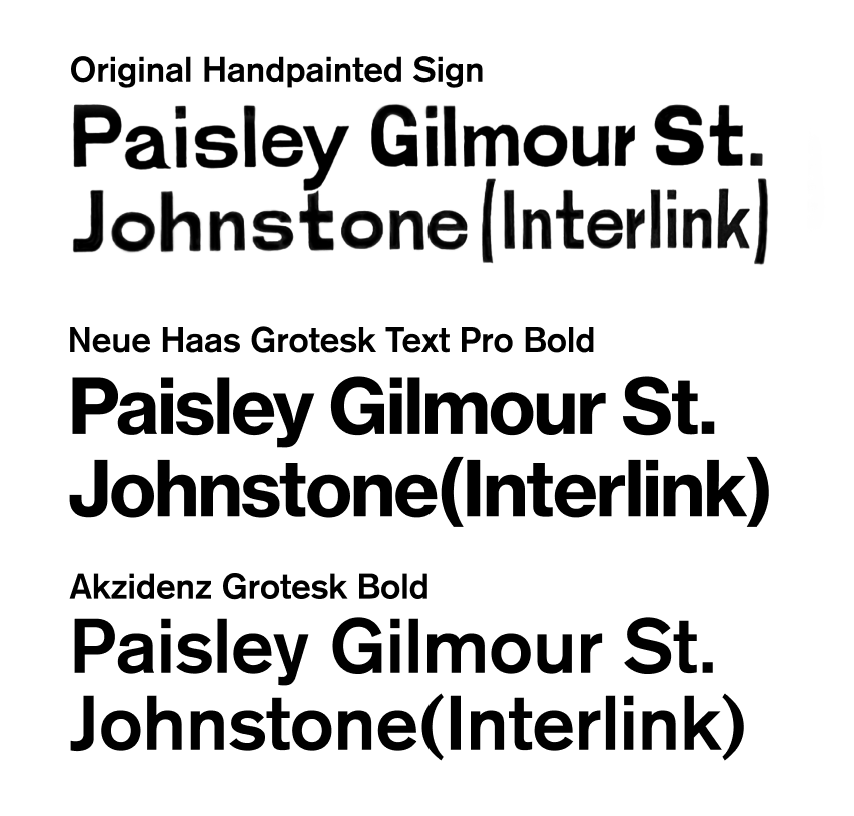

Grotesk fonts were popularized after the first world war, representing the modernist "international style"[^international] swiss design. I think it aptly represents the turn of the century industrialization of scotland. [Footnotes C: Retracing the origins of Akzidenz-Grotesk
](https://www.typeoff.de/2019/07/footnotes-c-retracing-the-origins-of-akzidenz-grotesk/)

[^international]: Its also important to critique the universalism in the modernist movement from a postcolonial perspective. (imagine the ego of calling your style "international", also le corbusier was a nazi sympathizer)

So we end up in a bit of a pickle. as I couldn't find any other fonts that were a closer match visually. With deadlines fast approaching, I realized I had to find another way.

## the taking a looksie on anatomy.

I discovered some useful insights from a deconstruction of the original sign:

- horizontal terminals
- high x-height
- flat terminal with rounded curves on the J and t
- vertical axis
- long descenders
- lower case r with a short arc of stem
- slanted w, v, and y (sometimes wider as well)
- flatter circles, such as on the o and s

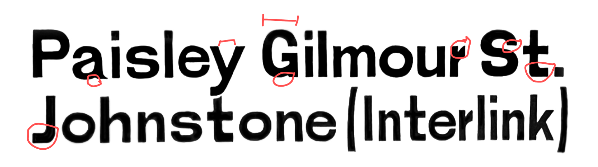

## off-kilter, now in digital

### fonts are like faces

so drawing faces is especially difficult because every person has seen so many faces in their life that they can immediately tell when a drawn face looks "off". in the same way, I think people are able to tell when a font doesn't look "right".

With this hypothesis in mind, I decided the font **only needs minute, small offsets** for a person to notice that letters look "off". I reduced the irregularities between letters to test this theory. To stay true to the mechanical nature of digital fonts, I also standardized the letters in various ways, from consistent widths of strokes to a more even kerning.

### digital "hitches" from cutting stencils

The painted sign is likely made using individual stencils of letters, and before the era of laser cutters and cnc, people had to cut these by hand. One common effect of hand cutting is the fact that curved lines are difficult to cut in one stroke, leading to "hitches" on the strokes. With the pen tool, I attempted to digitally "hitch" by using only straight lines.

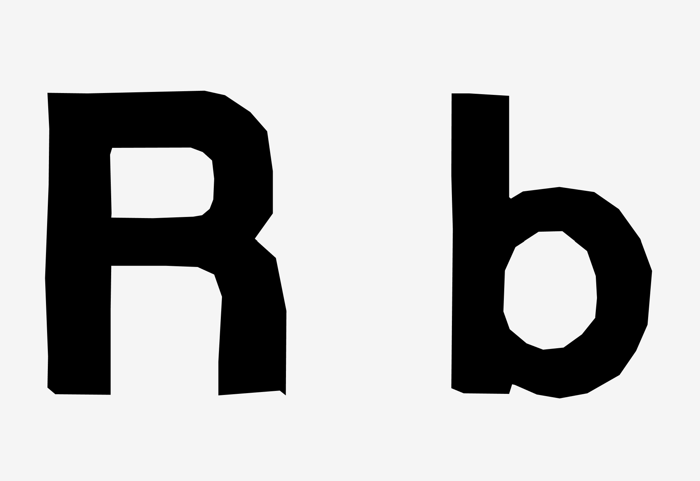
This was successful with some letters, and gave the intended "wobble" effect I was looking for. however, on extremely curved letters like "b" (as shown above), the straight lines were too noticeable.

### "curve and hitch"

One thing with hand cutting I didn't consider on my first run, is that while you _can_ do curved lines, you are limited in length by the arc of your arm length. this leads to a "curve and hitch" effect where curved lines are periodically broken with a sharp angles where you reposition your arm to complete the rest of the cut.

**[tbd] i havent done this yet lol**

## design and alignment

Much of my designing font knowledge comes from [design with fontforge](http://designwithfontforge.com/en-US/index.html), which goes pretty in depth on how to create a font from scratch.

I used the Capital "B" as a starting point to complete the font. this made for a heavier weighted bottom. I also used the B to standardize the stem width, and to get most of the characters to a consistant width.

Theres no clever techniques here, just the good ol' pen tool.

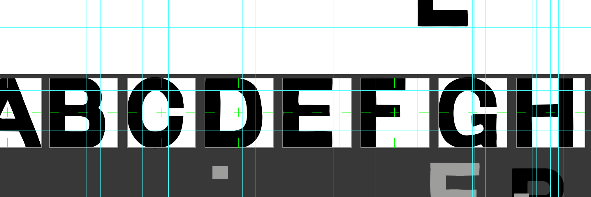

lower case letters are harder, as theres a lot more curves. I sued the letter I added extra lines so curved lines can go "over" the actual alignment line. This makes the font look "equal" in size optically.
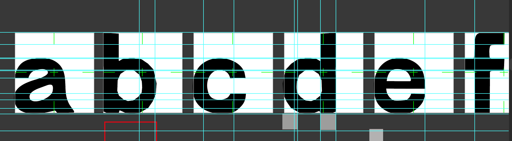
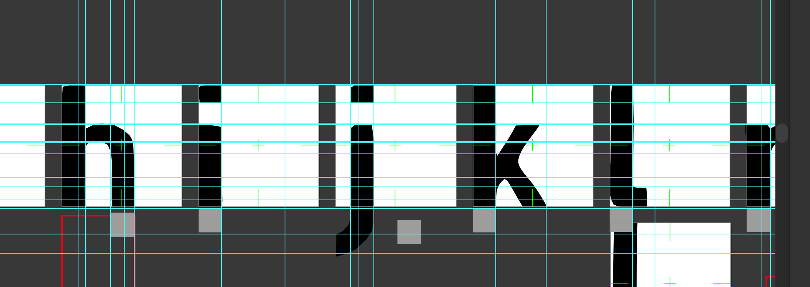

## fontbuilding with fontforge

I used the open source software [fontforge](https://fontforge.org/en-US/)
which, despite the vintage interface, offers quite a powerful set of tools to create fonts.

I used a couple of kerning matrices to get the spacing between the tables to look right. these tables allow me to "match" various characters together at once, speeding up the kerning process quite a bit.
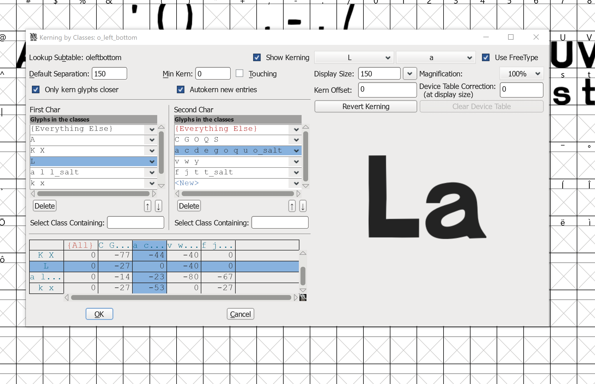

I added stylistic alternatives, which lets me have multiple sets of drawn letters.
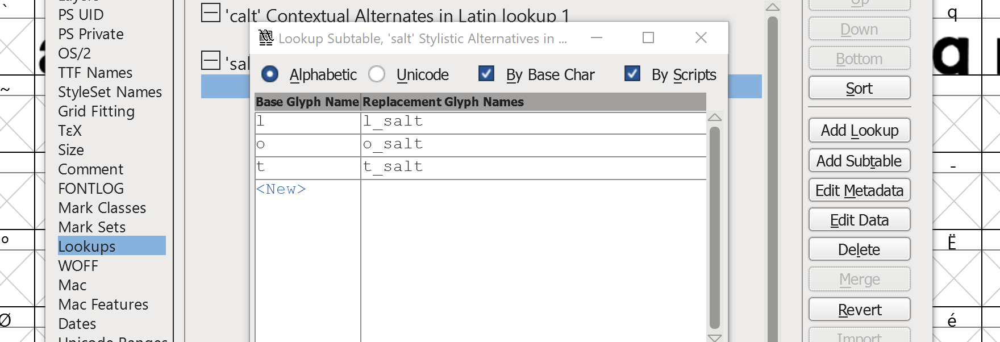

These combined with a simple contextual alternate rule allows for the font to have slight variations depending on the the set of characters. In this case, if the characters o, l, and t appear together twice in a row (tt, oo, to, lt, etc) then the the font will automatically switch between stylistic alternates.
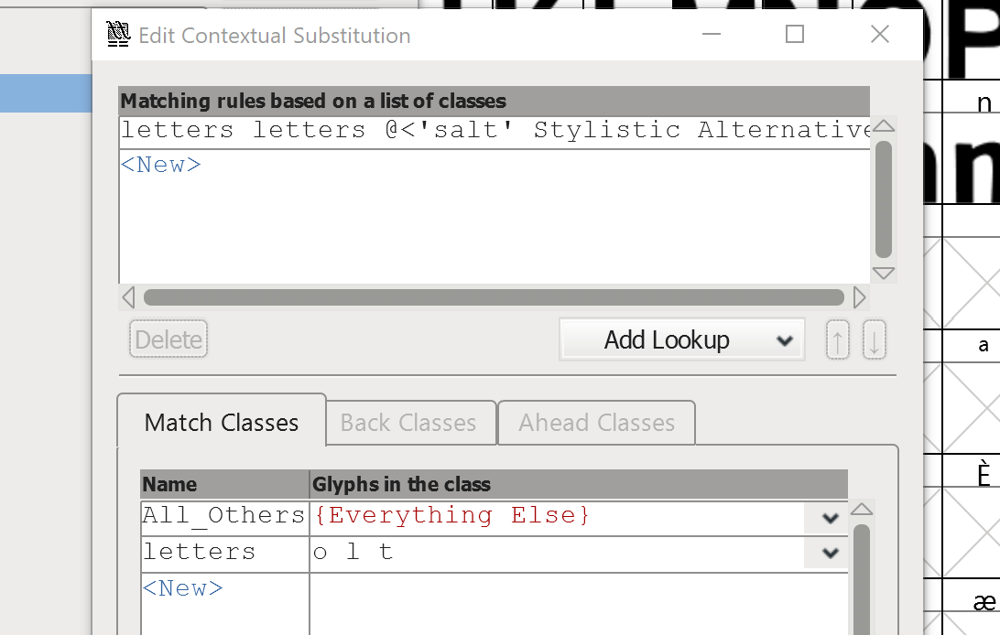

Finally, fontforge offers error checking to make sure fonts are compliant with opentype standards. i may have ignored these.

## the font in all its glory

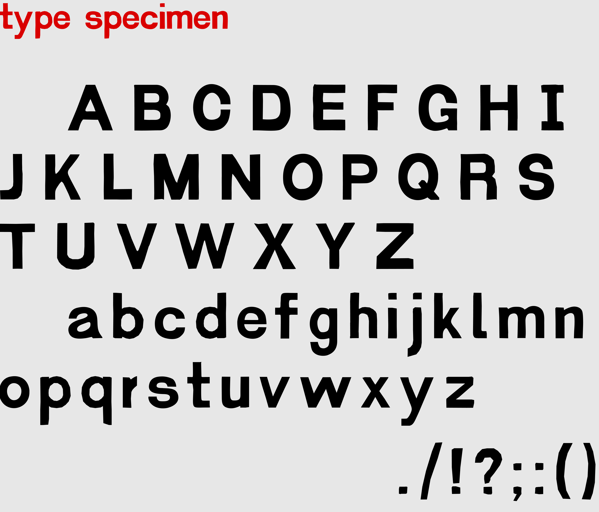

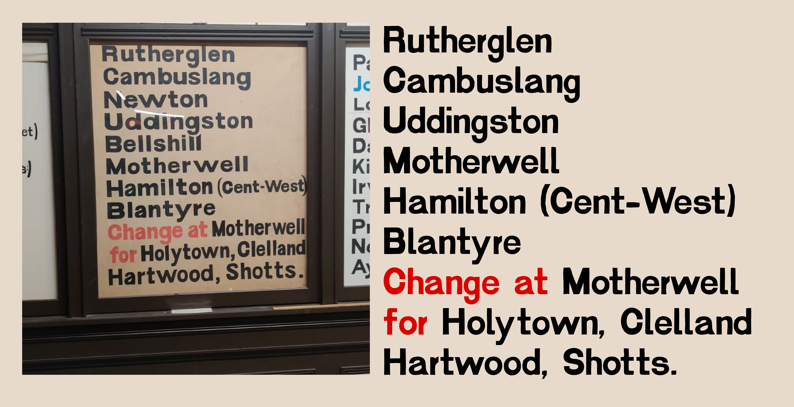

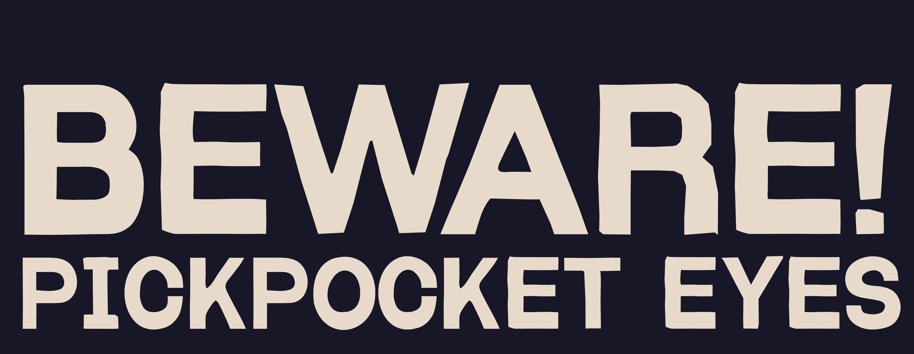

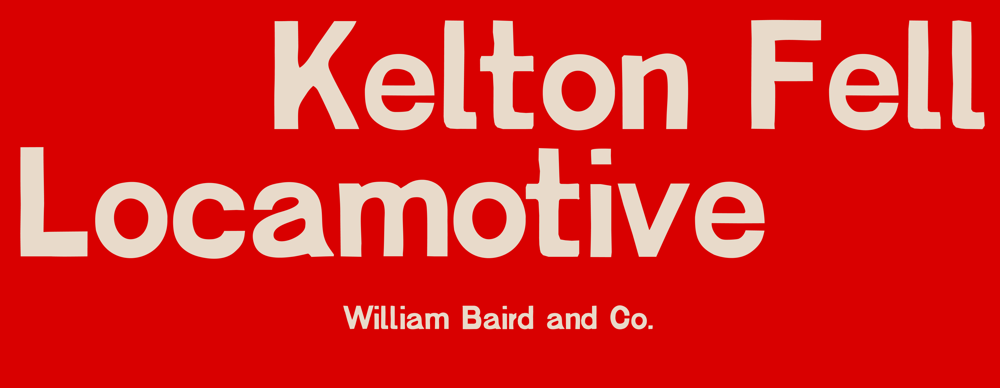
