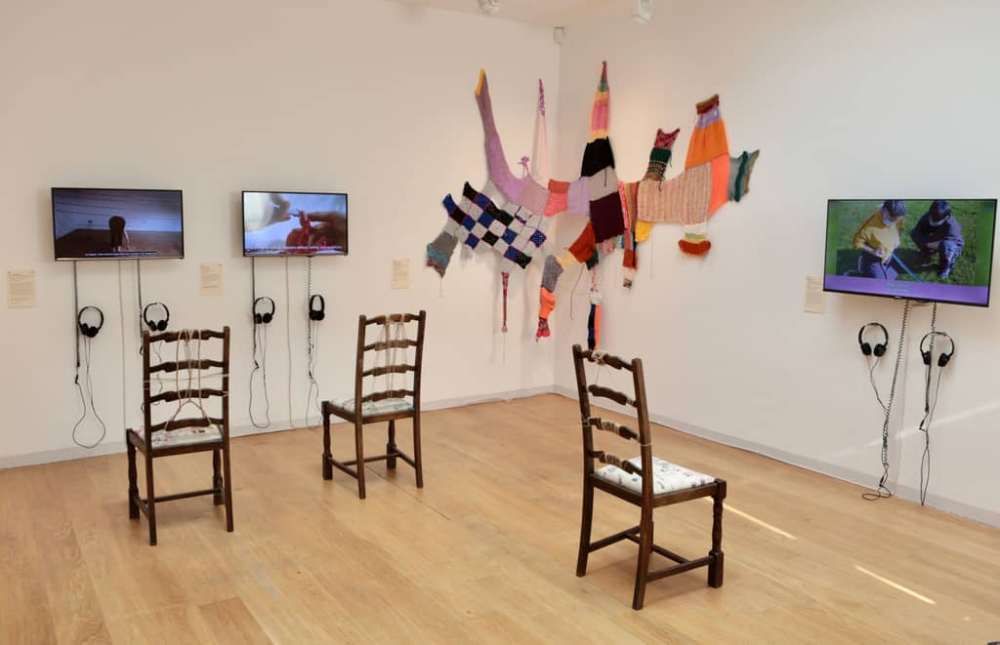

Looking back at my past design work and their processes, what I found most fun and most exciting was working with my friends. There always comes a point where all of us do not have any good ideas and we devolve into goofing off and making dumb things. This is my favorite part of the design process, and I want to portray that feeling/experience thru this design domain project.

## wiimotes and connections

I was originally thinking of a multiplayer type experience, but I had my doubts on how successfully I could do such a project.

after talking with paul, he suggested using something like a game controller so I could have immediate feedback and a smaller scope on the project.

He also told me about OSC(open sound control) which was a protocol I had no idea about

## the idea

I believe there is meaning-making in the act of collaboration. to struggle to make design together. In the conversations and working together, people can deepen their connections with each other.

### collaboration

I think about the [Exhibition _It all starts with a thread_](https://mawithathread.mmm.page/) at the Whitechapel Gallery of london that I visited. One of the works features the artists[^threadartists] with various collaborative pieces.

In particular, Raisa Kabir’s moving image piece, House Made of Tin stands out. In this piece, multiple people work together on a loom. As the documentation reveals, the struggle to collectively weave the piece together created a "physical support structure [...] completely woven, connects us all."[^houseoftin]



From the intentional struggle of weaving as a practice, creates understanding and connection with people.

[^threadartists]: Bella HowardBreakfast, Lunch and Dinner CollectiveFikayo AdebajoGut FeelingJulia Dèng HànzúKatarzyna PerlakLu Williams (Grrrl Zine)Raisa KabirTilda Scarlett from MA Curating Art and Public Programmes. https://www.whitechapelgallery.org/exhibitions/it-all-starts-with-a-thread/
[^houseoftin]: from Raisa Kabir's documentation of the piece. https://lids-sewn-shut.typepad.com/blog/2021/11/house-made-of-tin-a-socially-distanced-weaving-performance-2020-film-stills.html

### imprecision

Interesting and unexpected designs emerge from the glitchiness and imprecisions of the tools. Furthermore, this gives an air of silliness to the project.

#### aside: its important to stay unserious and silly

I know there is great irony in talking about silliness in design through a completely serious manner, but I feel like people are misunderstanding my position.

Its important to present design as unserious wherever possible. From its inception design has been a tool of the state. Ruben Pater talks about how the graphic designer was used to break the power of the printmaking unions. The Star Designer is exclusive, a creative genius, a lone wolf alpha male.

Drawing from [Design Justice Principles](https://designjustice.org/read-the-principles), I use sillyness to redefine the designer from an expert into a facilitator. This removes the air of importance that often causes people to be hesitant to participate in design. "Come and join! its not that serious" is the vibe I am going for.

### so... the idea?

the big idea is that I want to design an experience that is

1. collaboative
2. about making art/design
3. uses the wiimotes

The importance of the wiimotes is in their lack of precision, and their familiarity to users. PIcking up a wiimote needs less explanation.

SO my big idea was to either:

1. make a figma-like "design" tool that lets players drag around elements, but the elements will have a physics applied to them, letting them bounce around.
2. a "suburban home" builder for 2 players, using 3d models to make glitched and fucked up building plans. (this would fit in with some of my other ideas floating in my head)

I decided to go with idea #1, as it seemed easier to implement something in 2d. This also meant I could use a javascript stack for 2d, making it easier for me to put something together. I also thought perhaps I was overloading with the ideas on the second prompt.

This video from artist Nikita Diakur inspired me to use the physics engine:

import { YouTube } from "@astro-community/astro-embed-youtube";

<YouTube id='https://www.youtube.com/watch?v=1zUJzzRu-xs' />

I thought this would be interesting to implement, as there are really unexpected and uncontrollable effects that occur from the chaos of physics engines. I think this adds to the imprecision I am aiming for.

## wiimotes and windows

So, from this I decided to figure out connecting windows pcs and wiimotes

The first thing I did was try using wiiUPro, which did not work at all. I got the wiimote to connect, but it did not output any information that I could use.

The next thing I tried was GlovePIE, which was promising. It had a scripting interface that let me export the native wiimote commands into something other programs could understand. However, it had a limited number of things it supported as an outout, lke X-input. OSC was broken in the latest version of GlovePIE.


I thought i would have to hack something together with x-input, but then a savior appeared from the horizon: Chataigne, a french "orchestration" software used by installation and new media artists. This app had wiimote support, and let me export that data into a number of protocols, including OSC but more convenient for me, websockets. This means I have much more freedom in the software stack I want to use to make this work.


## phaser

Phaser js comes built in with a physics engine I have used before, matterjs.

import Video from "../../../components/Video.astro";
import video1 from "./2023-12-06 14-33-12-1.webm";

<Video src={video1} />

It was here that I realized that attaching the input from the wiimote was going to be a little harder then expected. Game engines have built-in helpers for common controllers such as touch or x-input, but that was not really useful to me. I was looking for something more low-level.

### connecting the engine

I originally chose a web stack because I had a thought that perhaps rendering type on web-based applications would have more control then processing or even a game engine (I was wrong, because canvas text rendering does not really support kerning.)

However as I worked through phaser js, it became clear that that was not how that worked. Phaser js is a completely isolated environment from regular html rendering, and does things its own way.


I used a custom plugin to route the data from websockets into the game engine. The issue was that becasue the "game" was in a different file, I could not access the global variables from the parent component that has the websocket code. The plugin sits in the parent, and simply gives access to the inside the global variable.

```js
let player1 = {
		x: 0,
		y: 0,
		pitch: 0,
		roll: 0,
		buttonA: 0,
		buttonHome: 0
	};

/// parent file
class Movement extends Phaser.Plugins.BasePlugin {
		constructor(pluginManager) {
			super(pluginManager);
			//initialize player state
		}
		//Additional methods for getting managing player data
		getPlayer1() {
			return player1;
		}
	}
/// child game file (contains loop)
update() {
    ...
		const plugin = this.plugins.get('Movement');
		const data = plugin?.getPlayer1();
		if (data) {
			if (data.buttonHome && !this.didclick) {
				window.location.reload();
				this.didclick = true;
			} else if (!data.buttonHome && this.didclick) {
				this.didclick = false;
			}
		}
    ...
}
```

Interfacing with a global variable this way is not really good, but since the data flow is one way ( from wiimote into game) and only the current data is important rather then past data, I think its not as harmful if the writes are a little slower then the read.

### generating text

I split the paragraph string into separate objects, so the physics engine can handle things correctly.


```javascript
function generateText(
  scene: Phaser.Scene,
  options = defaultTextOptions,
  style = defaultTextStyle
) {
  let textObjectData = [];
  let nextPosition = 0;
  let newLinePosition = 0;
  const array = options.text.split(" ");
  for (let i = 0; i < array.length; i++) {
    if (nextPosition > settings.width - 400 * scale) {
      newLinePosition += fontSize * 1.4;
      nextPosition = 0;
    }
    const text2 = scene.add.text(
      options.x + nextPosition,
      options.y + newLinePosition,
      array[i],
      style
    );
    text2.setX(text2.x + text2.width / 2);
    const textPhysics: Phaser.GameObjects.Text = scene.matter.add
      .gameObject(text2)
      .setFrictionAir(0.01)
      .setBounce(0.8)
      .setCollisionGroup(options.collisionGroup);
    nextPosition += fontSize / 4 + text2.width;
    textObjectData.push(textPhysics);
  }

  return textObjectData;
}
```

I wanted the text objects to not rotate, to stay readable, so I simply brute-forced it by overriding each text object.

```javascript
update() {
		if (this.textData && this.textData.length > 0) {
			this.textData.forEach((element) => {
				element.rotation = 0;
			});
		}
    ...
}
```

### resolution

There was an issue with resolution: the text in particulr looked blurry and fuzzy. I ended up doubling up on the resolution to fix this.

```javascript
const scale = 2;
const canvasHeight = 1000 * scale;
const fontSize = 32 * scale;

export const settings = {
  height: canvasHeight,
  width: canvasHeight * 1.3,
};
```

### collision groups

Phaser's way of dealing with the logic of which objects interact with each other is through collision groups.

```javascript
const canDrag = this.matter.world.nextGroup();
const textPhysics: Phaser.GameObjects.Text = scene.matter.add
  .gameObject(text2)
  .setFrictionAir(0.01)
  .setBounce(0.8)
  .setCollisionGroup(canDrag);
```

### uh oh (limitations)

I realized too late (day before the showcase) that Chataigne, for whatever reason, wasn't able to detect motionPlus, despite other software being able to do so. I submitted a bug report.


If I had more time, I would have switched to a mac, which has better wiimote support. I also wouldn't have used phaser since it doesnt have good type support anyways.
