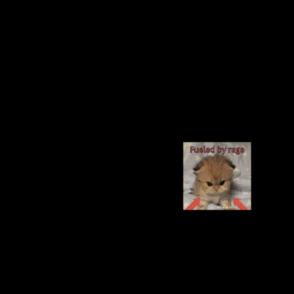

I'm trying out processing. i've never really used java and i come from a JS and c# world so i'm also not particularly familiar with the js OOP syntax. even in c#, i don't deal with weird syntax bc c# has streamlined and modernized the DX so much. so this is me on the lookout for processing/java equivalents to the workflows i am used to.

lets see how processing(java) works:

## external and internal iterators

so this is an external iterator in java:

```java
List<String> words = List.of("hello", "sky", "there", "den", "sky");
for (String word : words) {
    System.out.printf(word);
}

```

and this is an internal iterator in java

```java
List<String> words = List.of("hello", "sky", "there", "den", "sky");
words.forEach(name -> System.out.println(name))

```

so i guess i never really thought about it but `for()` loops vs. `.foreach()` are different in very specific use cases where u have to modify (specifically add/remove) things from that array you are accessing.[^jsiterator]

[^jsiterator]: [Java external vs internal iterator](https://zetcode.com/java/externalinternaliterator/)

in java and js + a couple of others, external iterators can throw an exception if u try to remove an array element as you are accessing them.

## hold on can i even use these in processing?

**nope. (lol)**

## ok now lets stop being distracted

i used some of the examples from [processing](https://processing.org/examples/constrain.html) and the [reference](https://processing.org/reference) to figure out some of the built-in functions that it has.

its a little annoying that have to have these open to figure out what the built in functions are, i wish the ide would simply tell me as i autofill or something.


(this gif was annoying to make[^gif])
[^gif]: why are gifs so annoying to make on windows??? i ended up recording the file on obs, and i manually set the video dimensions. then i used [adapter](https://macroplant.com/adapter), a free converter with a cute logo to turn it into a gif.

```java
/**
funny cat
*/
PImage img;
float x, y;
float easing = 0.01;
float imgw,imgh;
void setup() {
  size(640, 660);

  img = loadImage("cat_angry.png");
  int scale = 8;
  imgw = img.width/scale;
  imgh = img.height/scale;
}

void draw() {
  if (abs(mouseX - x) > 0.1) {
    x = x + (mouseX - x) * easing;
  }
  if (abs(mouseY - y) > 0.1) {
    y = y + (mouseY- y) * easing;
  }
  x = constrain(x, 0, width - imgw);
  y = constrain(y, 0, height -imgh);

  translate(x , y );
  image(img, 0, 0, imgw, imgw);

}
```

i basically copied the constrained example... i like the `constrain()` function, and i probably need to sit and read the entire docs to see what functions exist.

the examples show a very specific pattern for writing sketches,

- define global vars
- setup
- transforms
- render
